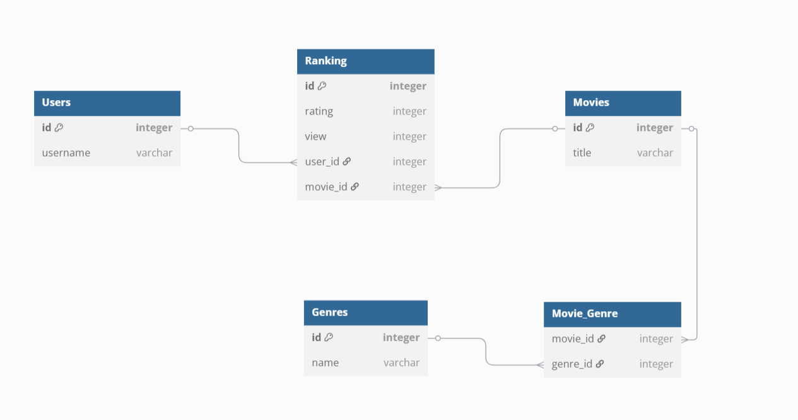
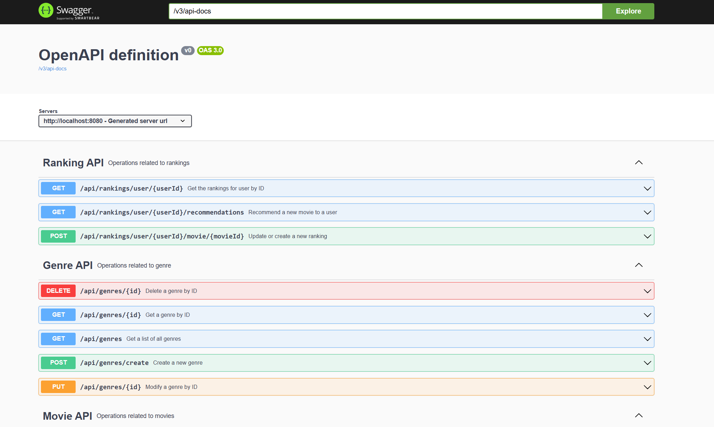
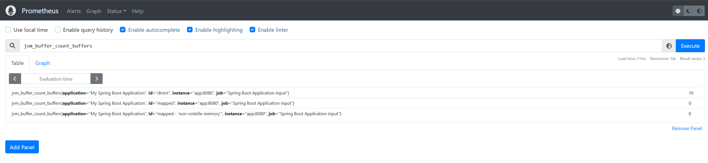
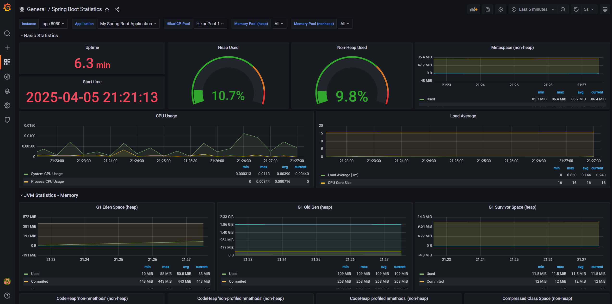

## Movie Application
This application is written with Spring boot (Java 21). It is a restful api to keep track of our movies database.
It tracks the movie, genre and user database. Besides it keeps track of rankings given by user to certain movies and it always is recommend to users similar movies to his liking.


### Features
* Retrieve a list of all movies belonging to a genre.
* Retrieve a list of all movies having an average rating above/below a certain value.
* Retrieve a list of user's interactions to movies (rating or view percentage).
* Add a new user's interaction to movie (rating or view percentage) .
* Recommend a list of movies to a user based on their preferences and history of interactions.
* Search for a list of movies matching a certain genre or a keyword in movie title.

### Project Tree
```console
├───.mvn
├───data
│   ├───grafana
│   └───prometheus
├───logs
├───public
│   ├───database
│   ├───grafana
│   ├───openapi
│   └───prometheus
├───src
│   ├───main
│   │   ├───java
│   │   │   └───com
│   │   │       └───contenetwise
│   │   │           └───recommender
│   │   │               ├───controllers
│   │   │               ├───domain
│   │   │               ├───dto
│   │   │               └───repositories
│   │   └───resources
│   │       ├───static
│   │       └───templates
│   └───test
└───target
```


### Technology Stack


1- Java 21

2- Spring boot 

3- Maven

4- PostgreSQL

5- Ubuntu/Linux

6- Docker

6- Git

7- Prometheus

8- Grafana


### Database
The application uses a database to maintain data persistence. For production the application is using Postgres, while it automatically switches to H2 database when running the test cases.

### Database Schema
Overview of Tables and Relationships:

* `Users`: Stores information about users, with a unique id and a username.
* `Movies`: Contains details about movies, each identified by a unique id and having a title.
* `Genres`: Lists different movie genres, each with a unique id and a descriptive name.
* `Ranking`: Records user rankings for movies. It includes a unique id, the rating given, the number of views, and foreign keys user_id referencing the Users table (indicating who made the ranking) and movie_id referencing the Movies table (specifying which movie was ranked).
* `Movie_Genre`: This is a many-to-many relationship table linking `Movies` to `Genres`. It contains foreign keys movie_id referencing the Movies table and genre_id referencing the Genres table, allowing a movie to belong to multiple genres and a genre to have multiple movies.

This schema provides the foundation for storing user data, movie information, genre classifications, and user-generated rankings, along with the relationships between these entities.



### Testing Environment
This project includes automated tests for the Spring Boot application. 
During testing, the application uses an in-memory H2 database 
to provide a fast and isolated environment.

🔧 Test Configuration

* Database: H2 (in-memory)

* Profile: test

* Schema Generation: Handled automatically via spring.jpa.hibernate.ddl-auto=create-drop

* No seed data is loaded during tests to ensure clean, reproducible test states.

### Production Environment
The production environment is configured to 
use a PostgreSQL database for robust and scalable data management.

🔧 Production Configuration

* Database: PostgreSQL

* Profile: production

* A seed file named `seed.sql` located in `src/main/resources` is available to populate the database with initial data.

This file can be executed automatically to set up required entities
such as default users, genres, or sample records.

### 📝 Logging
The Application includes a built-in logging system to help monitor 
activity, debug issues, and track application behavior.

📁 Log Output
* All logs are stored in the `logs/app.log` directory at the root of the project.

* Log files are automatically created and rotated based on the configured settings.

⚙️ Log Configuration
* Logging is configured via the `logback-spring.xml` file in `src/main/resources`

* Logs are rotated daily, and log files are archived with a date-based pattern (app-yyyy-MM-dd.log)

* A maximum of 7 days of logs are retained for easier management.


### Getting Started

#### Prerequisites
Before you start building or running the REST API using Spring Boot, make sure you have the following installed and set up:

1. Java Development Kit (JDK):
   Version Java 21 or higher (depending on your Spring Boot version).
   Check this step by running `java -version` in your terminal.

2. Maven: Used for project build and dependency management. Check this by running `mvn -v`.

3. Spring Boot:
   You don't need to install Spring Boot manually — it's managed by Maven. Use Spring Iniliazer to bootstrap your project.

4. IDE: For example IntelliJ IDEA (preferred with Spring plugin).

#### Installation
1- Clone the repository
``` console
git clone 
```
2- Build the latest jar in addition to running unit tests
```console
mvn clean package
```
2- Ensure docker service is running
``` console
docker --version
docker info
```
3- Run the docker compose file
``` console
docker compose up
```
4- Check all docker containers are up and running
```console
docker ps
```
You should see the following docker containers running:
* postgres
* spring-boot
* prometheus
* grafana

### API specification
This project utilizes Swagger (OpenAPI) to document and provide an interactive interface for exploring the application's API. 
You can access the live API specification and 
try out the endpoints directly through the Swagger UI at the following link:

[http://localhost:8080/swagger-ui.html](http://localhost:8080/swagger-ui.html)

This interface allows you to view available endpoints, their parameters, request and response structures, and even make test calls to the API without writing any code. 
It's a valuable tool for both development and understanding how to interact with 
the application programmatically. The API specification is automatically generated based on annotations within the Spring Boot application code, ensuring it stays up-to-date with the implemented endpoints.



### Examples
#### Return a list of movies belonging to Action genre

* Request: GET `http://localhost:8080/api/movies/by-genre?genre=Action`

* Response:
`
{
    "movies": [
        {
            "title": "Die Hard",
            "genres": [
                "Action",
                "Thriller"
            ]
        },
        {
            "title": "Star Wars: Return of the Jedi",
            "genres": [
                "Sci-Fi",
                "Action",
                "Adventure",
                "Fantasy"
            ]
        },
        {
            "title": "The Matrix",
            "genres": [
                "Sci-Fi",
                "Action"
            ]
        }
    ]
}
`
#### Return a list of movies ranking higher than a specific number
* Request: GET `http://localhost:8080/api/movies/by-min-ranking?minRanking=4`
* Response:
`
{
    "movies": [
        {
            "title": "Star Wars: Return of the Jedi",
            "genres": [
                "Action",
                "Sci-Fi",
                "Adventure",
                "Fantasy"
            ]
        },
        {
            "title": "Toy Story",
            "genres": [
                "Adventure",
                "Fantasy",
                "Animation",
                "Comedy",
                "Children"
            ]
        }
    ]
}
`
#### Add a new ranking of a user to a specific movie
* Request: POST `http://localhost:8080/api/rankings/user/1/movie/10?rank1=3`
* Response:
  `Ranking created successfully.`

### Prometheus
This application relies on data collected by Prometheus. To enable and modify Prometheus to scrape metrics from your Spring Boot application, check the yaml file in `data/prometheus/config/prometheus.yaml`
It has a job to target Spring Boot application's `/actuator/prometheus` endpoint. For example, if Spring Boot app runs on `localhost:8080` it uses `localhost:8080/actuator/prometheus`



### Grafana
This project includes a Grafana dashboard for visualizing application performance, endpoints monitoring and analytics 
You can access the Grafana instance running locally at:

[http://localhost:3000](http://localhost:3000)


**Default Credentials**

* **User:** admin
* **Password:** admin

**Setup Notes:**

* The data source for this dashboard is Prometheus running on port 9090 pulling the data from our Spring Boot Application.
* The dashboard definition can be found in `public/grafana/dashboard.json`. You can import this JSON into your local Grafana instance if needed.
